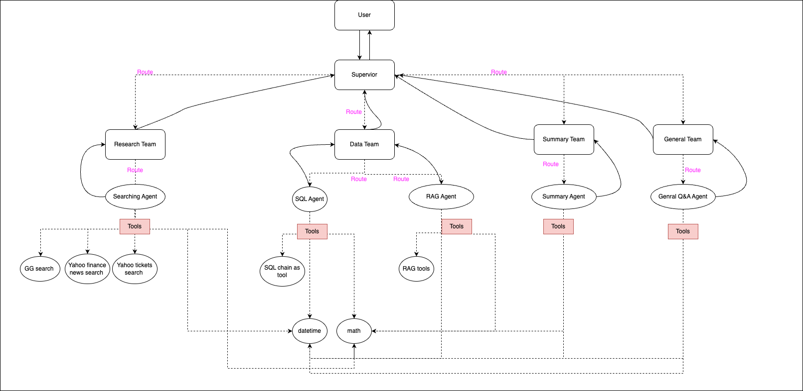
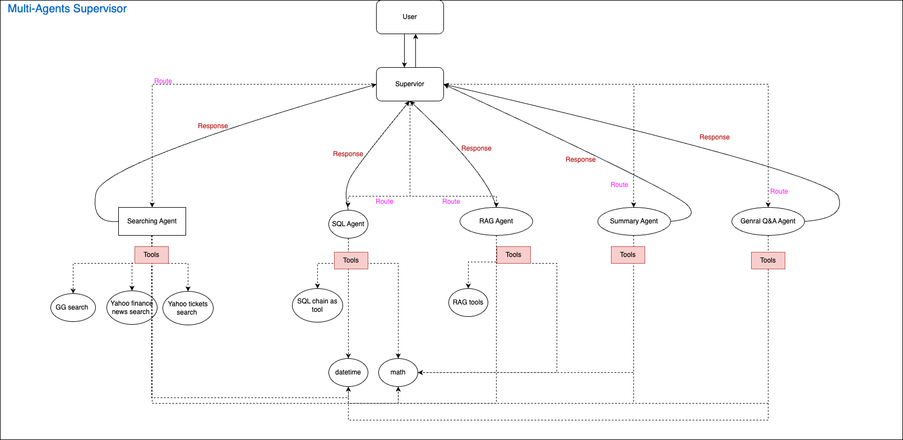

# 🍺🔗 LangGraph + Hierarchical Agent Teams + OpenAI model 🤝 Streamlit

An financial assistant for helping user in personal financial management. Basically, user can ask for his current finance health to get the summary and the advice from the bot to improve the finance health by reducing some unneeded expense or improving the spend. By the way, the user can question to get newest information like stock, ctypto prices,... from the internet, or any question related to finance domain to get the answer.

## Requirements
- OpenAI account tier 1 at least
- .env
- venv
- python 3.11

## TechStack
- LangChain
- OpenAI gpt-3.5-turbo for almost agents, and gpt-4-turbo for SQL Agent only
- Tools:
  - Datetime
  - Math
  - Yahoo Financial News
  - Yahoo Financial API
  - Google Serper search
  - SQL Database toolkit - Supabase connect
  - RAG
- Chat memory persistency with SQLLite
- GPTCache
- LangSmith
- Streamlit - App UI

## Orchestration



Orchestration Breakdown:
- Hierarchical Agent Teams
  - Top-level supervisor: orchestrate teams and connectors
  - Research Team: for searching tools to retrieve and gather newest information from the internet
  - Data Team: for SQL database retrieval and RAG with internal documents
  - Summary Team: for summarization tasks
  - General Team: for answering general questions mainly focused on the finance domain

- Multi-Agents Supervisor:
  - Supervisor for delegating the tasks to appropriate agents and listening to response to make a cycle route until finding a final answer
  - Research Agent: for searching tools to retrieve and gather newest information from the internet
  - SQL Agent: for SQL database retrieval by generating SQL query and execute
  - Retreiver Agent: for RAG with internal documents
  - Summary Agent: for summarization and analysis tasks
  - General Agent: for answering general questions mainly focused on the finance domain

## Technical notes
- Assume ENV=STAG is placing the app on Streamlit
- Only one table of the database with name: `expense` supported for now.

## Local Development Setup
- Install streamlit package
- pip

## Warning:
- If you run the app on macos locally, you should disable `pysqlite3-binary` from requirements.txt file before running pip install.
- defog/sqlcoder-7b-2 model is not producing higher accuracy results than gpt-4-turbo, or even gpt-3.5-turbo

## Running
```shell
streamlit run app.py
```

## Cost:
- GPT-4-Turbo tokens consume
- OpenAI Embedding
- Additional services quota: SERPER, Amplitude, LangChain Smith

## Next Plans
- Cost-effective prompt
- Optimize cache
- Speed up Agent execution